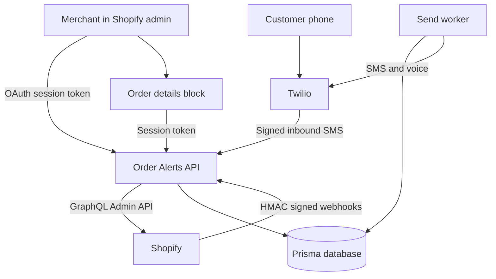

# Order Alerts

Order Alerts is a Shopify app by Matt Ryan. When an order is paid, shipped, delivered, cancelled, refunded, or left unfulfilled past a threshold, the app texts the customer through Twilio. Merchants can also turn on a short voice call for any of those events. Customers can reply by SMS, and the merchant reads the thread in an embedded admin and on the order page.

## Architecture



Shopify sends order webhooks to the Express API. The API checks the HMAC, stores the delivery id so retries are idempotent, and writes an outbound job. A worker in the same process claims due jobs, applies quiet hours and opt-outs, then calls Twilio. Inbound SMS is verified with the Twilio signature, stored on the matching order, and answered for STATUS, HELP, and STOP.

The embedded admin is a React app served by the same process. The order details block is a Shopify admin UI extension that reads the same thread API.

## Features

- OAuth install, offline token exchange for embedded session tokens, and Admin GraphQL for shop and order contact data.
- Webhooks for orders, fulfillments, fulfillment events, refunds, app uninstall, and the privacy compliance topics. Every delivery is HMAC verified.
- Events: paid, shipped with tracking, delivered, cancelled, refunded, and stalled (paid and still unfulfilled after N days).
- Per event, the merchant chooses SMS, voice, or both, and edits a template.
- Template variables: `customer_first_name`, `customer_name`, `order_name`, `order_total`, `tracking_number`, `tracking_url`, `tracking_company`, `shop_name`, `order_status_url`, `status_summary`.
- Quiet hours in the shop time zone. Sends wait until the window ends.
- STOP, STOPALL, UNSUBSCRIBE, CANCEL, END, and QUIT opt the phone out. START, YES, and UNSTOP opt back in. HELP and INFO return help copy. STATUS returns the latest order summary. Other replies are stored on the order thread.
- If Twilio Advanced Opt-Out is enabled, set `TWILIO_ADVANCED_OPT_OUT=true` so the app records the keyword and does not send a second STOP or HELP reply.
- Embedded conversations list, per-order thread, and settings page.
- Admin UI extension block for the order details page.
- Durable job table with retry and backoff. Duplicate webhooks do not send twice.

## Project layout

- `src/` Express API, domain rules, Prisma store, Twilio and Shopify clients.
- `web/` embedded admin UI.
- `extensions/order-sms-block/` order details block.
- `prisma/` schema and migrations.
- `tests/` Vitest unit tests with mocked Twilio and Shopify calls.
- `shopify.app.toml` app config for the Shopify CLI, including webhook subscriptions.

## Setup

Requirements: Node.js 20 or newer, a Shopify Partner account, a development store, the Shopify CLI, and a Twilio account with an SMS-capable phone number.

1. Install dependencies and create the local database.

   ```bash
   npm install
   cp .sample.env .env
   npx prisma migrate deploy
   ```

2. Fill in `.env`. Every variable is listed in `.sample.env` with a short comment. The server reads configuration only from the environment. `.env` is gitignored. Do not commit it.

3. In the Partner Dashboard, create an app and copy the client id and secret into `SHOPIFY_API_KEY` and `SHOPIFY_API_SECRET`. Request the scopes in `SCOPES` (`read_orders,read_customers`). Phone numbers on orders are protected customer data. A public app needs Shopify's protected customer data approval before those fields are returned. Development stores return them for installed custom apps.

4. Link the Shopify CLI app and start it. The CLI creates a tunnel, updates the app URL, and subscribes the webhooks declared in `shopify.app.toml`.

   ```bash
   shopify app config link
   shopify app dev
   ```

   `shopify app dev` runs `npm run dev`, which applies migrations and starts the API. Put the tunnel URL in `SHOPIFY_APP_URL` as well, with no trailing path, so Twilio signature checks use the same host Shopify calls.

   The client id in `shopify.app.toml` is a placeholder until `shopify app config link` writes the public client id. The API secret stays in `.env` only.

5. Point the Twilio phone number's incoming message webhook to `https://YOUR_APP_URL/webhooks/twilio/sms` with method POST. Use the same number as `TWILIO_FROM_NUMBER`. Leave Advanced Opt-Out off unless you set `TWILIO_ADVANCED_OPT_OUT=true`.

6. Install the app on a development store from the Shopify admin. Open Order Alerts to confirm the settings page. On an order page, add the Order alerts block from the block picker so the thread is visible next to the order.

`ALLOW_DEV_ADMIN=true` is only honored when `NODE_ENV=development`. It lets the local UI call the API without a Shopify session, using the shop in the `X-Dev-Shop` header. Leave it false for any shared environment.

For a local API without the CLI tunnel:

```bash
npm run dev
```

`GET /health` returns `{ "ok": true }` when the process is up.

## Testing

```bash
npm run typecheck
npm run lint
npm test
```

Vitest covers template rendering, webhook event mapping, Shopify HMAC verification, Twilio signature verification, opt-out keywords, quiet hours, settings validation, the send queue (retry, voice, suppression), inbound STATUS/STOP/HELP threading, and the Shopify GraphQL client with a mocked `fetch`. Twilio's SDK is mocked in the client test. The HTTP test posts signed webhook fixtures through Express.

GitHub Actions runs the same three commands on Node 22.

## Deployment

1. Provision a Node 20+ host and set every variable from `.sample.env`. Use `NODE_ENV=production`.
2. `npm ci`, then `npx prisma migrate deploy`, then `npm run build`, then `npm start`.
3. Run `shopify app deploy` to publish the app config, webhook subscriptions, and the order block.
4. Set `SHOPIFY_APP_URL` to the public origin and keep the Twilio webhook on `/webhooks/twilio/sms`.
5. Keep a single app process. The worker polls the database inside that process, and startup returns any job left in `processing` back to `pending`. Run one instance, or move the worker out before you scale horizontally.
6. SQLite is appropriate for local development and a single small instance with the database file on persistent disk. For a managed database, change the Prisma datasource provider to `postgresql`, point `DATABASE_URL` at it, and create a migration before deploying.

The app answers Shopify privacy webhooks. `customers/data_request` stores a snapshot of the matching orders and messages. `customers/redact` deletes that customer. `shop/redact` deletes the shop. `app/uninstalled` marks the shop inactive and drops offline sessions so the worker stops sending.

Stalled-order scans run on `STALLED_SCAN_MS` (default one hour) and only see orders the access token can read. Shopify's default `read_orders` scope covers about the last 60 days. `read_all_orders` is a protected scope and is not requested by default.
